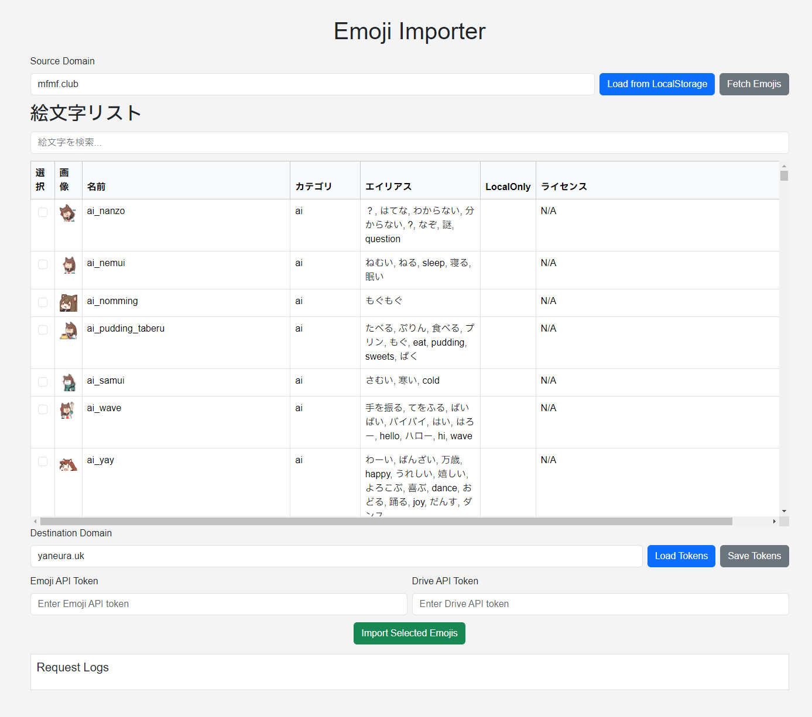

# misskey-emoji-manager

Misskey向けの絵文字インポートツールです。  
Misskey標準の機能ではタグやライセンスの確認をしたり、そのままインポートすることができないので補助ツールとして作成しました。  
バグを見つけたらご報告いただけると助かります。~~たぶんバグたくさんあるので~~  



ローカルで実行する際は以下手順です。
```
yarn install
yarn serve
```

以下の説明は少し古くなっているのでサイトを参照してください。  
サイトでもインポート作業を実行できます。  
https://tools.e17.dev/emoji-manager/  

---

Source Domainにインポート元のドメインを、Destination Domainにインポート先のドメインを入れます。  
MisskeyとFirefishで動作確認が取れています。Sharkeyでもたぶん使えると思います。  
~~インポート元にFirefishを指定することはできますが、現段階でインポート先にFirefishは指定できないと思います。そのうち対応するかもしれません。~~  

インポート元のドメインを入力したら初回は「Fetch Emojis」ボタンを押してください。2回目以降はローカルに保存されているデータを使うときは青の「Load from LocalStorage」ボタンを押すことを推奨します。サーバーで絵文字の更新があった場合など最新のデータを取りたいときは「Fetch Emojis」を押してください。  
ただし「Fetch Emojis」は大量の通信を行うので短時間で繰り返すとサーバーに迷惑がかかりますので慎重に行ってください。  
ちなみに初回から「Load from LocalStorage」を押すと、データがないのでFetch Emojisしてもいいですかと訊かれるのでそれでもOKです。  
ドメイン毎に絵文字のリストはローカルストレージに保存されますので、たとえば yojohan.cc と mfmf.club の絵文字リストを両方保持しておけます。  

絵文字を取得中は一番下の「Request Logs」に進捗が流れます。絵文字数によりますが30秒～数分以上かかる場合がありますので気長にお待ちください。  
ログがすぐ止まってしまったり、404などのエラーが出る場合には非対応のサーバーの可能性があります。その場合は `@kanade@mfmf.club` にご連絡ください。インポート元のサーバー管理者に問い合わせたりすると迷惑がかかってしまいます。  

取得が正常に完了すれば表に絵文字の一覧が表示されるはずです。  

検索などで絞り込んで、一番左にチェックを入れた絵文字を対象に、Destination Domainに指定したドメインに対してインポート処理を行うことができます。  
なおローカル限定の絵文字はチェックすることができません。  

インポートはファイルをURLからアップロードし、それを絵文字として登録する流れになっていますので、管理者権限の「絵文字を操作する」「絵文字を見る」権限を付与したトークンと、「ドライブを見る」「ドライブを操作する」権限を付与したトークンがそれぞれ必要です。  
現在のMisskeyの仕様ではファイルをアップロードしたアカウントが消えた場合はファイルごと消えてしまいますので、絵文字管理用のアカウントを作ってそのドライブに保存することをオススメします。  
たとえば管理者権限を持つ @admin で「絵文字を操作する」「絵文字を見る」のAPIトークンを発行、絵文字のファイルをアップロードするために @emoji で「ドライブを見る」「ドライブを操作する」のAPIトークンを発行します。  
なお管理者アカウントでどちらの権限も付与して同一のトークンを使うこともできます。  

発行したらそれぞれのトークンを Emoji API Token と Drive API Token に入力します。  
Save Tokens ボタンで Destination Domain に紐付けてそれぞれのトークンをローカルストレージに保存することができます。  
また保存したトークンはドメインを入力して Load Tokens を押すことでローカルストレージからロードすることができます。保存されていない場合はその旨が表示されます。  

複数の絵文字を同時にインポート可能です。ファイルが混ざらないようにするため処理にはひとつあたり2000msのウェイトを開けています。可能性は低いですがインポートしたあと画像が入れ替わったりしていないか確認をお願いします。  
（サーバーによってはキャッシュの都合でサムネだけ違う画像になってい舞うことがあるようです）  
ライセンスやカテゴリもそのまま取り込みますので、必要に応じてMisskeyの管理画面から変更することができます。  

なお同じ絵文字名がすでに存在している場合は `/api/emoji/add` でエラーになります。  
ファイルのURLインポート前にチェックしているので重複にはなりません。

